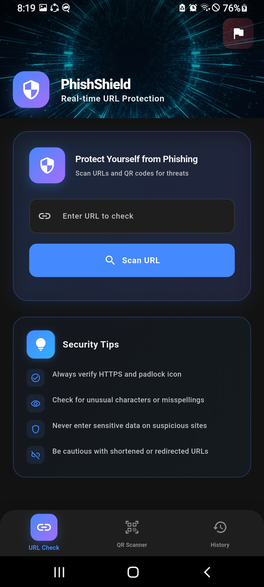
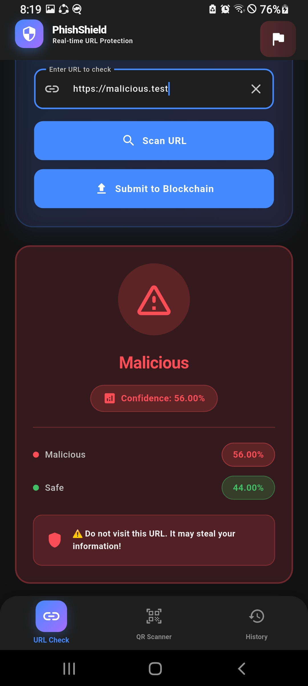
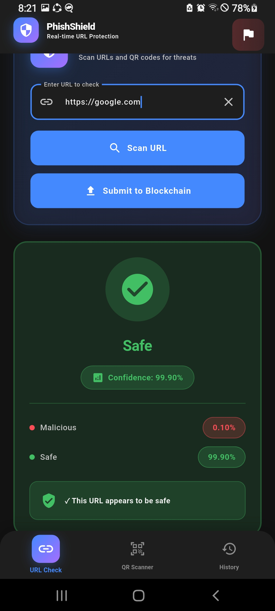
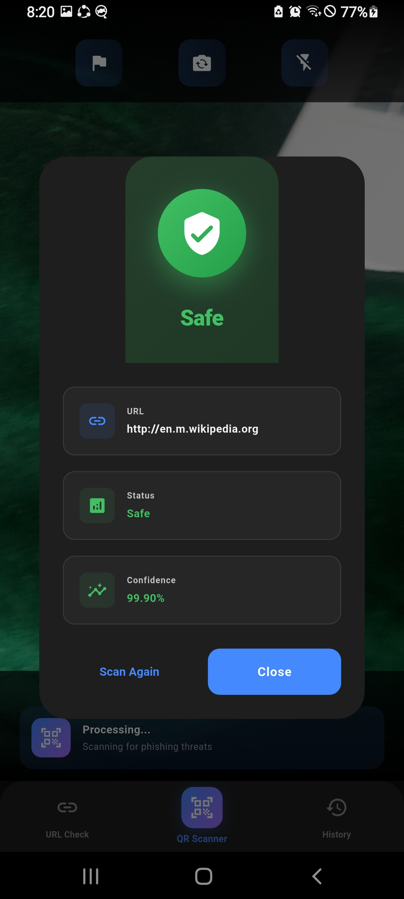
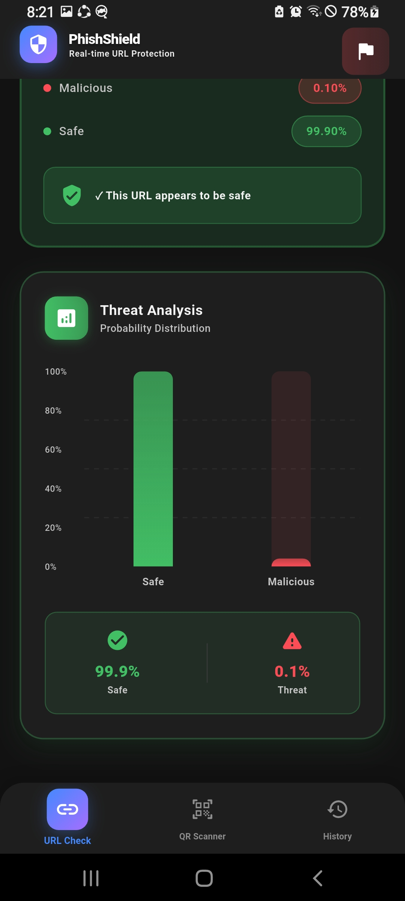

<div align="center">


[](https://git.io/typing-svg)

<br>

[](https://flutter.dev/)
[](https://www.python.org/)
[](https://ethereum.org/)
[](https://pub.dev/packages/web3dart)
[](LICENSE)

*The Next-Generation Mobile Security Suite protecting your digital identity.*

[🎥 Live Demo](#-live-demo) • [🏗 Architecture](#-system-architecture) • [📸 Screenshots](#-app-gallery) • [🚀 Features](#-key-features)

</div>

---

## 🎥 Live Demo

Experience the fluid animations and real-time detection in action.

<div align="center">
  <video src="assets/demo/app_flow.mp4" width="100%" controls autoplay loop muted></video>
  
  *> **Note:** If the video above does not play, please check the `assets/demo/` folder or [download it here](assets/demo/app_flow.mp4).*
</div>

---

## 🏗 System Architecture

We utilize a **Hybrid-Intelligence Architecture** combining local processing, cloud AI, and decentralized ledgers.

```mermaid
graph TD
    A[User App (Flutter)] -->|1. Paste URL/Scan QR| B(Core Logic)
    B -->|2. Feature Extraction| C{AI Engine (Flask)}
    C -->|3. Random Forest Analysis| D[Prediction Score]
    
    D -->|Safe?| E[UI Success Animation]
    D -->|Phishing? | F[UI Warning Alert]
    
    F -->|User Confirmation| G[Blockchain Service]
    G -->|Sign Transaction| H[Ethereum Network]
    H -->|Store Report| I((Immutable Ledger))
    
    subgraph "Mobile Client"
    A
    B
    E
    F
    G
    end
    
    subgraph "Cloud Intelligence"
    C
    D
    end
    
    subgraph "Decentralized Web"
    H
    I
    end
```

---

## 📸 App Gallery

| **Security Hub** | **QR Sentinal** | **Threat Intelligence** |
|:---:|:---:|:---:|
|  |  |  |
| *Glassmorphic Dashboard* | *Live Camera Analysis* | *Instant Threat Blocking* |

<details>
<summary><b>Example: Safe Validation Flow (Click to Expand)</b></summary>
<br>

| **Safe URL** | **Safe QR Scan** | **Analytics** |
|:---:|:---:|:---:|
|  |  |  |

</details>

---

## 🚀 Key Features

### 🧠 Random Forest AI Layer
Our proprietary model is trained on the **Kaggle Phishing Intelligence Dataset**, featuring:
*   **30+ Feature Vectors**: Analyzing IP encoding, URL length, HTTPS tokens, redirect chains, and more.
*   **Nano-Latency**: Optimized Flask API returns predictions in <200ms.

### ⛓️ Blockchain "Truth" Layer
PhishShield leverages the **Ethereum Blockchain** to create a decentralized database of verified threats.
*   **Transparency**: No central authority controls the blacklist.
*   **Immutability**: Once reported, a threat cannot be hidden.
*   **Smart Contracts**: Automated logic for verifying and storing reports.

### 📱 "Liquid" UX Design
*   **Framework**: Flutter 3.x
*   **Animation**: Physics-based animations using `flutter_animate`.
*   **Visuals**: Deep obsidian backgrounds with neon accent gradients (`#00FF99`, `#FF0055`) and frosted glass elements.

---

## �️ Installation & Deployment

### 1. The Brain (Backend)
```bash
cd backend
pip install -r requirements.txt
python app.py
# Server starts at http://192.168.100.50:5000
```

### 2. The Body (Frontend)
```bash
# Clone & Install
git clone https://github.com/muhammadwasif12/phishshield-App.git
cd phishshield
flutter pub get

# Run on Device (High-Performance Mode)
flutter run --profile
```

### 3. The Soul (Blockchain)
*   Deploy contracts via Remix or Hardhat.
*   Update ABI and Contract Address in `lib/features/blockchain_report/services`.

---

## 🤝 Roadmap
- [x] AI Model Deployment
- [x] QR Code Integration
- [x] Blockchain Reporting
- [ ] Browser Extension
- [ ] iOS Vision Pro Support

---

<div align="center">
  <br>
  <b>Designed & Engineered by Muhammad Wasif</b><br>
  <i>"Security is not a product, it's a process."</i>
  <br><br>
  <a href="https://github.com/muhammadwasif12">
    
  </a>
</div>