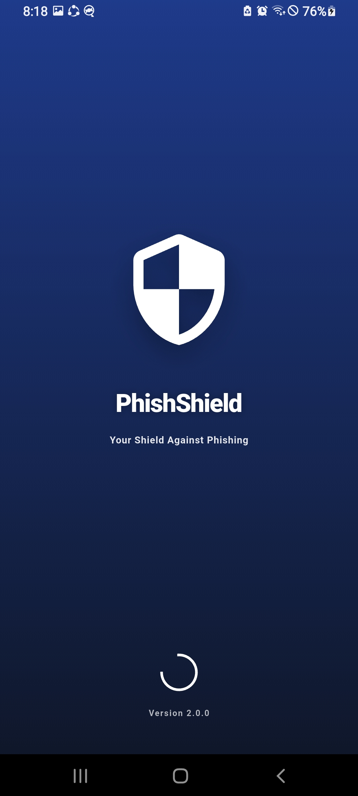

<div align="center">

# 🛡️ PhishShield
### The Ultimate AI-Powered Phishing Defense System

[](https://flutter.dev/)
[](https://www.python.org/)
[](https://flask.palletsprojects.com/)
[](https://scikit-learn.org/)
[](https://ethereum.org/)
[](LICENSE)

*A Multi-Layered Defense Application combining Machine Learning, Blockchain Transparency, and Mobile Security.*

[Architecture](#-system-architecture) • [Screenshots](#-app-gallery) • [Features](#-features) • [Installation](#-installation)

</div>

---

## 🚀 Overview

**PhishShield** is not just an app; it's a comprehensive security ecosystem. We address the growing threat of phishing by combining three powerful technologies: **Artificial Intelligence**, **Blockchain**, and **Mobile Engineering**.

Our system provides real-time threat analysis using a **Random Forest** model trained on massive datasets, ensuring that even the newest zero-day phishing attacks are detected instantly. Furthermore, we empower the community with a decentralized reporting mechanism, storing threat intelligence permanently on the **Ethereum Blockchain**.

---

## 🏗️ System Architecture

### 1. 🧠 Only-AI Intelligence Core
*   **Model Architecture:** Random Forest Classifier (Ensemble Learning).
*   **Training Data:** Curated **Kaggle Phishing Dataset** containing thousands of verified legitimate and malicious URLs.
*   **Performance:** High accuracy with low false-positive rates.
*   **Deployment:** The model is wrapped in a high-performance **Flask API** (Python), serving real-time predictions to the mobile client.

### 2. ⛓️ Blockchain Transparency Layer
*   **Decentralized Ledger:** Verified phishing attempts are not just stored in a central database; they are reported to the **Ethereum Network** (Local/Testnet).
*   **Smart Contracts:** custom Solidity contracts handle the submission and storage of malicious URL reports.
*   **Transparency:** Uses a "Fake" (Test/Dev) Ethereum account to simulate gas fees and transaction signing without real-world costs during development.

### 3. 📱 Ultra-Premium Mobile Experience
*   **Framework:** Built with **Flutter**, ensuring 60fps performance on both Android and iOS.
*   **State Management:** Powered by **Riverpod** for robust and scalable state handling.
*   **Visuals:** Features a "Glassmorphism" UI, dynamic animations, and a sleek Dark Mode.

---

## 📸 App Gallery

Experience the interface designed for security and elegance.

| **Splash & Home** | **QR Scanning** | **Threat Detection** |
|:---:|:---:|:---:|
|  <br> *Secure Entry* |  <br> *Dashboard* |  <br> *Malicious URL Detected* |

| **Safe Scanning** | **Detailed Reports** | **Graphs & History** |
|:---:|:---:|:---:|
|  <br> *Safe Site Verification* |  <br> *QR Safety Check* |  <br> *Visual Analytics* |

---

## ✨ Key Features

### 🔍 Smart URL Inspector
Paste any link, and our Flask-backed AI runs a 30+ point feature extraction (checking IP presence, URL length, redirection counts, etc.) to give you a percentage-based safety score.

### 📷 Advanced QR Guard
Don't trust QR codes blindly. PhishShield scans the code, extracts the payload, and sends it to our AI engine **before** your browser opens it.

### 🛡️ Community Reporting (Web3)
Found a phishing site? Report it! Your report is signed and sent to the blockchain, creating an immutable record of the threat that cannot be tampered with.

### 📊 Offline History & Analytics
All your scans are saved locally using **SQLite**. View your safety trends over time with beautiful, animated charts.

---

## �️ Tech Stack Breakdown

| component | Technology | Description |
| :--- | :--- | :--- |
| **Frontend** | Flutter (Dart) | Cross-platform mobile UI |
| **ML Model** | Scikit-Learn | Random Forest Algorithm |
| **Backend API** | Flask (Python) | REST API hosting the AI model |
| **Blockchain** | Solidity & Web3Dart | Smart Contracts & DApp Integration |
| **Database** | SQLite (sqflite) | Secure local storage |
| **Networking** | Dio | Advanced HTTP client |

---

## 🔧 Installation

### Prerequisites
1.  **Flutter SDK** installed.
2.  **Python 3.x** installed (for the backend).
3.  **Node.js & Hardhat** (optional, for local blockchain).

### 1. Backend Setup (AI Model)
Navigate to the backend directory (repository separate or included) and run:
```bash
pip install flask scikit-learn pandas numpy
python app.py
```
*Ensure the server is running on `192.168.100.50:5000` (or update `url_scanner_remote_data_source.dart`).*

### 2. Mobile App Setup
```bash
# Clone the repository
git clone https://github.com/muhammadwasif12/phishshield-App.git

# Install dependencies
flutter pub get

# Run the app
flutter run
```

---

## 🤝 Contributing
1.  Fork the Project
2.  Create your Feature Branch (`git checkout -b feature/AmazingFeature`)
3.  Commit your Changes (`git commit -m 'Add some AmazingFeature'`)
4.  Push to the Branch (`git push origin feature/AmazingFeature`)
5.  Open a Pull Request

---

## 📄 License
Distributed under the MIT License. See `LICENSE` for more information.

<div align="center">
Built with ❤️ by Muhammad Wasif
</div>